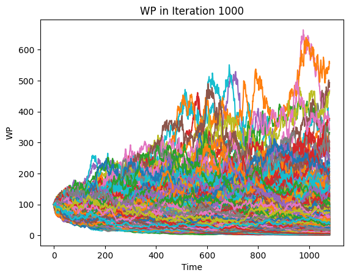

# ELS Stepdown Three Stocks Monte Carlo

## 프로젝트 개요
이 프로젝트는 **ELS(Eqity-Linked Securities) 스텝다운 구조**를 가정한 뒤, 세 개의 기초자산(주가)에 대한 **몬테카를로(Monte Carlo) 시뮬레이션**을 통해 발행 시점의 이론 가격(가격 산출 및 시뮬레이션 결과)을 분석하는 예제입니다.

**주요 목표:**
1. **세 개의 기초자산(주가) 경로**를 난수 기반으로 시뮬레이션
2. **스텝다운 ELS** 구조의 쿠폰 지급 및 낙인(knock-in) 조건 등을 반영
3. 만기 시점 혹은 조기상환 시점에서의 **최종 손익(페이오프) 계산**
4. 여러 시나리오 반복(몬테카를로)으로 **기댓값 및 통계량** 산출

이 노트북은 **금융공학 및 투자상품 설계**를 체험할 수 있는 샘플 코드로 작성되었습니다.

---

## 개발 히스토리
- **최초 작성:** 2023년 12월 11일  
- **업데이트:** 2025년 3월 (노트북 정리 및 시각화 보완)  
- **Google Colab에서 작성 후 GitHub로 공유**  
- **Matplotlib을 활용한 결과 시각화**

---

## 폴더 구조
```
ELS_Stepdown_Three_stocks_MC.ipynb   # 주요 코드 (구글 코랩에서 실행 가능)
WP_in_Iteration_1000.png            # 자산 가격 시뮬레이션 그래프 예시
README.md                           # 프로젝트 설명 파일
```

---

## 기능 요약
### 1️⃣ 랜덤 난수 생성 & 자산 경로 시뮬레이션
- 기하 브라운 운동(GBM) 또는 다변량 정규분포를 사용
- 상관관계를 고려하여 세 자산이 동시에 움직이는 시나리오 반영

### 2️⃣ ELS 스텝다운 조건 반영
- 조기 상환 관찰 시점별 쿠폰 지급률
- 낙인(Knock-In) 배리어 조건 (원금 손실 여부 판단)
- 최종 만기 시점에서의 손익(Payoff) 계산

### 3️⃣ 몬테카를로(MC) 시뮬레이션
- 수만 번 이상의 시나리오 반복
- **기댓값**, **분산**, **최빈값** 등 통계량 도출
- 자산 경로(WP)의 진행 상황 그래프 (`WP_in_Iteration_1000.png`) 작성

### 4️⃣ 결과 시각화
- 시뮬레이션된 자산 경로들을 한 그래프에 중첩하여 수렴 양상 확인
- ELS 평가 결과를 히스토그램/라인 차트 등으로 표현 가능

---

## 예시 그래프
아래는 1,000회의 시뮬레이션에서 자산 경로(WP)를 시각화한 결과입니다.



- **X축:** 시간 
- **Y축:** 주가(또는 가치)  
- **다양한 난수 시나리오**에서 주가가 어떻게 변동하는지 한눈에 볼 수 있음

---

## 실행 방법

### 1. Google Colab에서 실행
1. `ELS_Stepdown_Three_stocks_MC.ipynb` 파일을 Colab에 업로드
2. 각 셀을 순차적으로 실행하여 시뮬레이션 수행
3. 중간 결과(자산 경로, 확률분포 등) 시각화

### 2. 로컬 환경 (Jupyter Notebook)
```bash
jupyter notebook "ELS_Stepdown_Three_stocks_MC.ipynb"
```

---

## 마무리
본 예시는 **ELS 스텝다운 상품**을 단순화하여 모형화했으며, **실제 금융상품 설계**에는 금융사 내부의 다양한 파라미터와 복잡한 배리어/쿠폰 구조가 추가로 고려될 수 있습니다. 그러나 이러한 샘플 프로젝트를 통해 **금융공학 시뮬레이션**의 기본 흐름을 이해할 수 있습니다.

**추천 학습 방향:**
- 다양한 스텝다운 ELS 구조(조기상환 시점, 낙인 배리어 등)의 변경 실험
- 변동성, 상관관계, 드리프트 등의 파라미터 민감도 분석
- 옵션 Greeks 계산(델타, 감마 등)을 통한 리스크 관리 측면 검토
